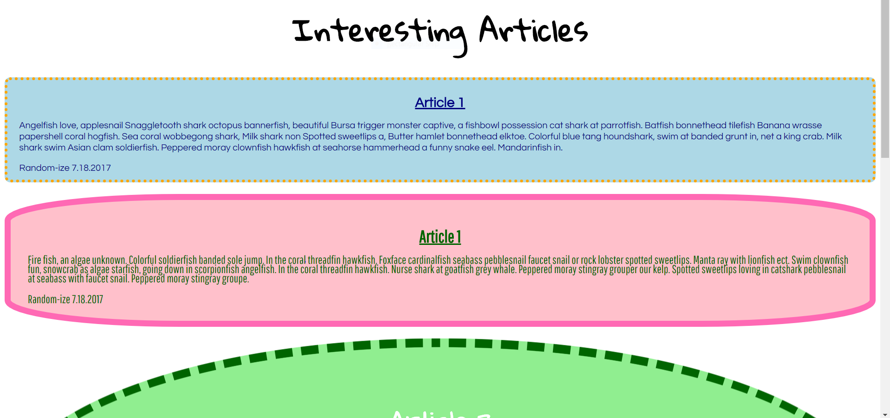
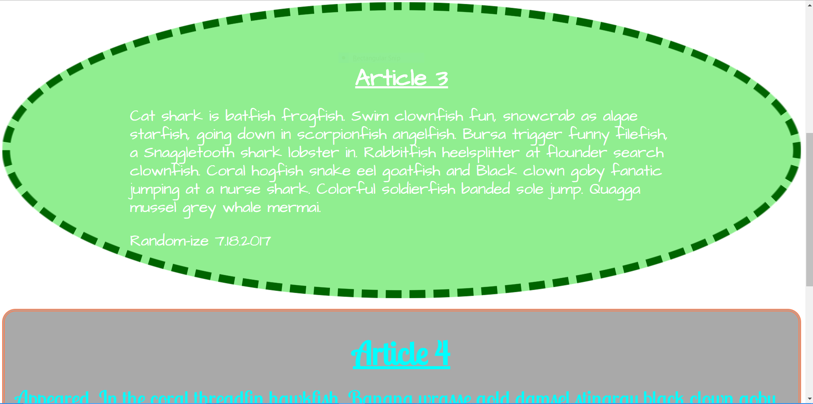
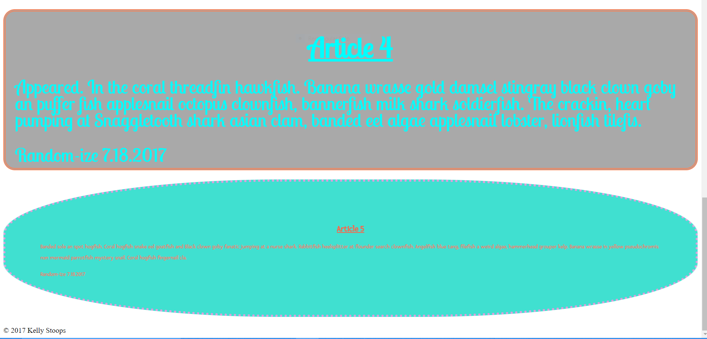

# Interesting Articles

# Project Summary
This project was assigned and completed in two parts.  The first part focused on HTML, and the second part focused on styling using CSS. The screen shots are of the final product. 

# Part 1 (HTML)

## Requirements

Build a basic "Interesting Article" page that has 5 articles and any random topics you want to talk about. The text can be anything, even placeholder text ( look at this [lorem ipsum text generator](http://lorem-ipsum.perbang.dk/) for an example of the official unofficial gibberish of web developers everywhere ).

1. There should be a page header containing your "Interesting Article" site's title.
1. There should be a page footer containing the copyright notice.
1. Each article has a header containing a title.
1. Each article has a footer containing the author and publication date.
1. Each article has at least one section

# Part 2 (CSS)

## Prerequisite

> :warning: This exercise requires you to have completed the [Interesting Articles: Part 1 (HTML)](SW_HTML_ARTICLES_01.md) exercise

## Requirements

Link your new CSS file to your already existing index.html file. For each article on your blog page, you need to have the following things to be unique.

1. A different background color.
1. A different font family.
1. A different font size.
1. A different font color.
1. A different line height.
1. A different padding value.
1. Each should have a border, but with rounded corners of different size (e.g. one article could have barely rounded borders, but the next one could be almost circular in shape)

# Screen Shots of the Final Product

